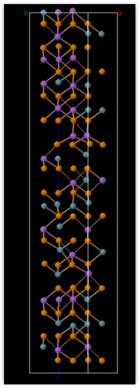
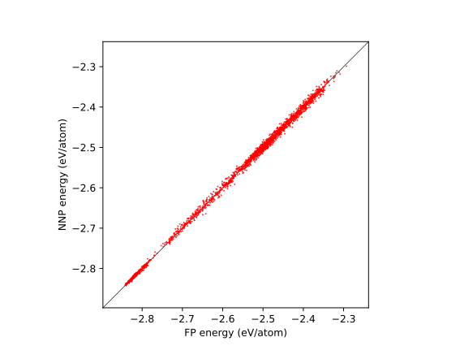
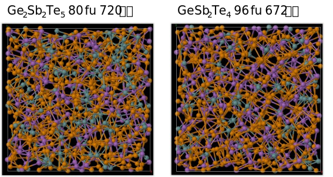
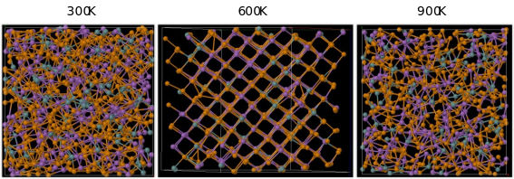
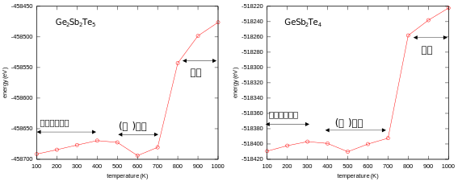
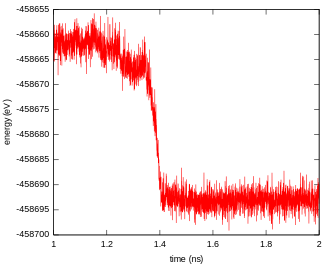

概要
====

GeSbTeは“相変化材料”として知られている。低温でアモルファス状態のGeSbTeは，温度を上げることによって結晶化させることができる。その後さらに温度を上げ，急冷させるとアモルファス状態に戻すことができる。このような特性から，記憶媒体など様々な用途で応用がなされている。

本件ではGeSbTeのニューラルネットワークポテンシャル (neural-network
potential, NNP)
を作成した。液相・アモルファス相・立方晶のGeSbTe系が記述可能で，melt
quenchシミュレーションを行うことができ，アモルファス相から結晶に転移する様子がとらえられるポテンシャルが得られることを目標とした。

本稿ではどのようにニューラルネットワークポテンシャルを作成したか説明する。また，ニューラルネットワークポテンシャルを用いた分子動力学シミュレーションを実行する方法について具体的に解説する。

ニューラルネットワークポテンシャルについて
==========================================

本件で作成したニューラルネットワークポテンシャルについて簡単に説明する。詳しくは文献[1],
[2]などを参照されたい。

ニューラルネットワークポテンシャルとは，その名が示す通り原子間ポテンシャルをニューラルネットワークによって記述するものである。ニューラルネットワークとは入力層・任意の数の隠れ層・出力層からなるネットワークである。各層は任意の数のノードからなり，さらにバイアス層が紐づけられている。
$i$ 番目の層における $j$ 番目のノードの出力 $y_{i}^{j}$ は， $i - 1$ 番目の層の $k$ 番目のノードの出力 $y_{k}^{j - 1}$ を入力として以下のように計算される。

$$y_{i}^{j} = f_{i}^{j}\\left( b_{i}^{j} + \\sum_{k = 1}^{N_{j - 1}}{w_{k,i}^{j - 1,j}y_{k}^{j - 1}} \\right)$$

ここで $w_{k,i}^{j - 1,j}$ は $j - 1$ 番目の層の $k$ 番目のノードと $j$ 番目の層の $i$ 番目のノードとの間の重み係数， $b_{i}^{j}$ は $j$ 番目の層の $i$ 番目のノードに対するバイアス層からの寄与である。
$w_{k,i}^{j - 1,j}$ や $b_{i}^{j}$ が教師データを再現するよう学習によって決める量である。
$f_{i}^{j}$ は $j$ 番目の層が $i$ 番目のノードにもたらす作用を表すactivation functionと呼ばれる関数である。
通常activation functionとしては何らかの非線形性を持つ関数が用いられる。
また，非常に小さいか大きい値に対しては-1, 1, 0などの値に収束する性質をもつ。
具体的にはシグモイド関数やガウス関数などが用いられる。出力層においては線形の関数が用いられる場合もある。
なお，「0番目の層の出力」とはすなわち入力ベクトルのことである。
出力層における出力はただ一つの値であり，そのニューラルネットワークポテンシャルに紐づいている原子のエネルギーに対応する。

ニューラルネットワークによって原子間ポテンシャルを表現する場合，その入力ベクトルは原子配置に関連するものであるが，原子配置のxyz座標をそのまま利用することはできない。
これは，原子座標はたとえば原子の入れ替えや全体の回転などの操作に対して不変ではないからである。
そこで，保たれるべき不変性が保たれるsymmetry functionという関数が用いられる場合が多い。
たとえば以下のような関数が用いられる。

$$G_{i}^{2} = \\sum_{j = 1}^{N_{\\text{atom}}}{{\\exp \\left \\lbrack - \\eta_{2} \\left( r_{\\text{ij}} - R_{s} \\right)^{2} \\right \\rbrack}{f_{c} \\left( r_{ \\text{ij}} \\right)}}$$

$$G_{i}^{3} = 2^{1 - \\zeta} \\sum_{j \\neq i}^{}{\\sum_{k \\neq i,j}^{}{\\left( 1 + \\lambda \\cos \\theta_{\\text{ijk}} \\right)^{\\zeta} \\exp \\left \\lbrack - \\eta_{3} \\left( r_{\\text{ij}}^{2} + r_{\\text{ik}}^{2} + r_{\\text{jk}}^{2} \\right) \\right \\rbrack f_{c} \\left( r_{\\text{ij}} \\right)f_{c} \\left( r_{\\text{ik}} \\right)f_{c} \\left( r_{\\text{jk}} \\right)}}$$

$G_{i}^{2}$ は $i$ 番目の原子に対する2体のsymmetry functionである。
$r_\\text{ij}$ は原子ij間の距離であり， $\\eta_2$ や $R_s$ はこのsymmetry functionの特性を決める係数である。
$f_{c}( r_{\\text{ij}} )$ はカットオフ関数であり，カットオフ距離に近づくにつれ0へなめらかに減衰する関数が用いられる。
$G_{i}^{3}$ は $i$ 番目の原子に対する3体のsymmetry functionである。
$\\theta_{\\text{ijk}}$ は原子ijkの成す角度であり， $\\eta_{3}$, $\\lambda$, $\\zeta$ がこのsymmetry functionの特性を決める係数である。
Symmetry functionは異なる $\\eta_{2}$, $\\eta_{3}$, $R_{s}$, $\\lambda$, $\\zeta$ を持つものをいくつ用意してもよい。多く用意すればそれだけ多様な原子配置を表現することができるが，当然計算負荷は高くなる。記述したい系の違いをなるべくうまく差別化できるように選べることが望ましい。
Symmetry functionの選び方の指針は，たとえば文献[3], [4]などにおいて提案されている。

ニューラルネットワークは通常一つ一つの原子に与えられ，それによってその原子のエネルギーが計算される。このようにして求められた各原子のエネルギーの和がその系のエネルギーとなる。第一原理計算においては通常エネルギーは全系のものがただ一つ求まるのでこの分け方は便宜的なものととらえることもできるが，原子ごと（元素ごと）にニューラルネットワークを割り当てることによって教師データとして用いた系とは異なる原子数（場合によっては異なる化学量論比）の系に対しても適用できるようになるというメリットがある。

ニューラルネットワークポテンシャルはうまく作成すれば第一原理計算の結果を原子当たり1
meVの精度で再現できる高精度な手法である。他方なんらかの物理的なモデルに基づくものではないため，教師データの“外挿”は不得手としている。排除体積効果さえも含まれないので，うまくいかない場合は極端に短い結合が現れるなど分子動力学シミュレーションとして破綻してしまうような場合もある点がデメリットである。

ニューラルネットワークポテンシャルの作成
========================================

ニューラルネットワークポテンシャルの作成方法
--------------------------------------------

ニューラルネットワークポテンシャルを作成するためには，「教師データ」が必要となる。これは原子座標データと対応する全エネルギーと場合によっては原子間力である。このデータは第一原理分子動力学シミュレーションの軌跡から得ることが多い。ニューラルネットワークポテンシャルは教師データの外挿は苦手なので，適用したい領域を包含する原子配置を教師データとして採用する必要がある。

教師データからニューラルネットワークポテンシャルを作成するソフトウェアとして
n2p2 (https://github.com/CompPhysVienna/n2p2), ænet
(http://ann.atomistic.net/), deepmd
(https://github.com/deepmodeling/deepmd-kit) などがある。本件ではn2p2
[5]を用いた。

教師データの作成
----------------

ニューラルネットワークポテンシャル作成に必要な教師データはPHASE/0コード[6]による第一原理分子動力学シミュレーションの軌跡より得た。

第一原理分子動力学シミュレーションの計算条件
~~~~~~~~~~~~~~~~~~~~~~~~~~~~~~~~~~~~~~~~~~~~

第一原理分子動力学シミュレーションは以下のような条件で行った。

==================== ============================================
計算条件             設定値
==================== ============================================
カットオフエネルギー 25 Rydberg
*k*\ 点サンプリング  cubic系： $2 \\times 2 \\times 1$
                     
                     アモルファス，液体： $\\Gamma$ 点のみ
収束判定条件         1e-8 hartree/atom
時間刻み             4 fs
アンサンブル         NVTアンサンブル
==================== ============================================

cubic Ge\ :sub:`2`\ Sb\ :sub:`4`\ Te\ :sub:`5`\ の第一原理分子動力学シミュレーション
~~~~~~~~~~~~~~~~~~~~~~~~~~~~~~~~~~~~~~~~~~~~~~~~~~~~~~~~~~~~~~~~~~~~~~~~~~~~~~~~~~~~

GeSbTe系の典型例としてGe\ :sub:`2`\ Sb\ :sub:`4`\ Te\ :sub:`5`\ があげられる。Ge\ :sub:`2`\ Sb\ :sub:`4`\ Te\ :sub:`5`\ は結晶としては立方晶系と六方晶系があり，六方晶の方がエネルギー的には安定であると言われている。他方アモルファス相とのスイッチングに使いやすいのはエネルギー的には近いであろう立方晶の方ではないかと考えられる。そこで，ここでは結晶の教師データとして立方晶のGe\ :sub:`2`\ Sb\ :sub:`4`\ Te\ :sub:`5`\ を用いることにした。

立方晶Ge\ :sub:`2`\ Sb\ :sub:`4`\ Te\ :sub:`5`\ は，面心立方格子の<111>方向に原子がTe/SbないしGeないし空孔/Te/SbないしGeないし空孔/…
という具合にスタックした構造である。その典型例は次に示すような構造である。

|image0|

図1 Ge\ :sub:`2`\ Sb\ :sub:`4`\ Te\ :sub:`5`\ の結晶構造の例

上図において緑色で描画されている球がGe, 紫色で描画されている球がSb, 橙色で描画されている球がTeである。
Ge:Sb:Teを2:2:5という比率で成立させるため細長い単位胞となっている。
Teの位置は固定であるのに対し，GeとSbは空孔を含めランダムになっている。
そこで，Ge/Sb/空孔位置をランダムに埋めた構造を20通り用意し，分子動力学シミュレーションの初期原子配置とした。
温度は500Kと1500 Kを採用し，各々1万ステップの\ *NVT*\ 第一原理分子動力学シミュレーションを実行した。

液体Ge\ :sub:`2`\ Sb\ :sub:`2`\ Te\ :sub:`5`\ の第一原理分子動力学シミュレーション
~~~~~~~~~~~~~~~~~~~~~~~~~~~~~~~~~~~~~~~~~~~~~~~~~~~~~~~~~~~~~~~~~~~~~~~~~~~~~~~~~~

立方体の単位胞に10
fu分の原子をランダムに敷き詰めた構造を初期構造とした。温度3000Kで\ *NVT*\ 第一原理分子動力学シミュレーションを行った。Ge\ :sub:`2`\ Sb\ :sub:`2`\ Te\ :sub:`5`\ の融点は900K程度なので非常に高温のシミュレーションであるが，多様な構造のサンプリングを狙いこの温度を採用した。Ge格子定数を二種類用意し，それぞれに対して4万ステップ程度のシミュレーションを行った。

メルトクエンチシミュレーション
~~~~~~~~~~~~~~~~~~~~~~~~~~~~~~

上述の液体のシミュレーションから20通りの初期配置をサンプルし，急冷のシミュレーションを実施した。温度3000Kから300Kまで3万ステップかけて冷却した。アンサンブルは\ *NVT*\ を採用した。

教師データサンプリング
~~~~~~~~~~~~~~~~~~~~~~

第一原理分子動力学シミュレーションのステップ間のデータは相関が強く，毎ステップサンプルして教師データとするとデータ数に対して十分多様なデータが得られない可能性が高い。そこで，得られた軌跡から25ステップに一度サンプルすることによって最終的な教師データとした。データ点数は合計で43,000ほどとなった。

GeSb\ :sub:`2`\ Te\ :sub:`4`\ の教師データ追加
~~~~~~~~~~~~~~~~~~~~~~~~~~~~~~~~~~~~~~~~~~~~~~

後述の手続きで作成したNNPを用いてGeSb\ :sub:`2`\ Te\ :sub:`4`\ の急冷シミュレーションを実施し，教師データに追加した。合計で4000点ほど追加した。

n2p2コードを用いたニューラルネットワークポテンシャルの作成
----------------------------------------------------------

ニューラルネットワークポテンシャルはn2p2コード[5]を用いて作成した。Symmetry
functionは文献[4]の方針に従い定義した。二体のsymmetry
functionは元素の組み合わせあたり5通りで計45通り，三体のsymmetry
functionは元素の組み合わせあたり20通りで計360通り用意した。カットオフ距離は6
Åとした。Activation functionとしては隠れ層に対してはhyperbolic
tangentを，出力層に対しては線形の関数を採用した。ニューラルネットワークとしては隠れ層二層，各層あたり20ノードとした。エネルギーだけでなく原子間力も学習に用いる設定を採用した。教師データの9割を学習に，1割をテストに用いた。そのほか学習の仕方の詳細などについてはn2p2のデフォルト設定を採用した。
結果得られたニューラルネットワークポテンシャルを用いて作成したparity plotを次に示す。

|image1|

図2 得られたニューラルネットワークポテンシャルのparity plot.

得られたニューラルネットワークポテンシャルは，学習に用いたデータに対してもテストデータに対してもおおよそroot
mean square errorがエネルギーに対して6 meV/atom，原子間力に対して0.22 eV/Åの精度で教師データを再現することができた。
ニューラルネットワークポテンシャルは問題によってはエネルギーに対して1
meV/atom以下の精度を得ることもできる場合があるが，ここで得られた精度は第一原理計算そのものの精度と比較できるオーダーであり，実用上十分であると考えている。

ニューラルネットワークポテンシャルの使い方
==========================================

ポテンシャルファイル
--------------------

ポテンシャルファイルはn2p2ディレクトリー以下に配置されている。以下のファイルが存在する。

- input.nn
- scaling.data
- weights.032.data
- weights.051.data
- weights.052.data

input.nnファイルにはNNPに用いられているニューラルネットワークに関する情報などが記録されている。scaling.dataファイルにはsymmetry
functionのスケーリングに関する情報が記録されている。weights.032.data,
weights.051.data, weights.052.dataファイルにはそれぞれGe, Sb,
Teのニューラルネットワークの重みが記録されている。このディレクトリーをインプットスクリプトにおいて指定することによって利用することができる。

プログラムのコンパイル方法
--------------------------

n2p2をインストールする方法
~~~~~~~~~~~~~~~~~~~~~~~~~~

n2p2をインストールする方法について説明する。Linux環境
(WSL上のLinuxでも可)を想定しているが，macOSにも似た手続きによってインストールできるかもしれない。

必要なライブラリーのインストール
^^^^^^^^^^^^^^^^^^^^^^^^^^^^^^^^

n2p2は

GSL (https://www.gnu.org/software/gsl/)と

Eigen (https://eigen.tuxfamily.org/)

を必要とする。利用したい環境にこれらがインストールされていない場合上述のウェブサイトからアーカイブをダウンロードする。バージョンにそれほど依存しないはずなので，最新版をダウンロードすればよい。

また，BLAS
(https://www.netlib.org/blas/)も必要である。BLASはすでにインストールされている場合も多いと思われるが，インストールされていない場合は何らかのBLASの実装を入手し，インストールする。

GSLはコンパイルする必要がある。通常のGNU/Linuxアプリケーションの手続きによってコンパイルすることができる。すなわち

::

  ./configure
  make
  sudo make install

のような手続きである。管理者権限のないアカウントで作業をする場合は./configureのあとに--prefix=INSTALL_DIRECTORYをつけることによって書き込み権限のあるディレクトリーをインストールするディレクトリーとして指定する。この場合環境変数LD_LIBRARY_PATHにINSTALL_DIRECTORY/libを加える必要がある。

Eigenはテンプレートライブラリーなのでコンパイルする必要はないが，解凍後得られるトップディレクトリーの下にあるINSTALLファイルに記述されている方法でインストールしておくことを推奨する。

n2p2のコンパイル
^^^^^^^^^^^^^^^^

n2p2のアーカイブを配布元
(https://github.com/CompPhysVienna/n2p2/releases)
からダウンロードし，展開する。バージョンは分子動力学シミュレーターLAMMPS
(https://www.lammps.org/)に正式に取り入れられた2.14以降を用いる。

ソースコードはsrcディレクトリー以下に配置されている。srcディレクトリーに配置されているファイルやディレクトリーは下記の通り。

- application/
- doc/
- interface/
- libnnp/
- libnnpif/
- libnnptrain/
- makefile
- makefile.gnu
- makefile.intel
- makefile.llvm
- pynnp/

makefile.gnuはgcc用の設定が記述されたファイル，makefile.intelにはIntel oneAPI用の設定が記述されたファイル，makefile.llvmはclangコンパイラー用の設定が記述されたファイルである。
これらの内利用したいコンパイラーに対応したファイルをエディターなどで開き，以下の赤色で示した部分を編集する。

::

  PROJECT_GSL=/usr/local/include/gsl
  PROJECT_EIGEN=/usr/local/include/eigen3

PROJECT_GSLにはGSLのインクルードファイルのパスを指定する。
gslのインストール先がたとえば/home/user/gslだった場合この指定は/home/user/gsl/include/gsl となる。
PROJECT_EIGENにはEigenのインストールディレクトリーを指定する。
Eigenのインストール先がたとえば/home/user/eigen3だった場合この指定は/home/user/eigen3/include/eigen3となる。

この編集ができたら，たとえばmakefile.gnuを使う場合

::

  make COMP=gnu

というコマンドを実行するとn2p2のコンパイルが始まる。
問題が発生しなければNNPを作成するためのプログラムがbin以下に，LAMMPSなどとリンクするためのライブラリーがlib以下に生成される。

n2p2のNNPが利用できるLAMMPSをビルドする方法
~~~~~~~~~~~~~~~~~~~~~~~~~~~~~~~~~~~~~~~~~~~

LAMMPSのアーカイブを配布元 (https://www.lammps.org/)からダウンロードする。
バージョンはn2p2を正式に取り込んだ29 September 2021版以降を利用する。

まずはn2p2を取り込むための準備として，lib/hdnnpディレクトリーへ移り，そこに配置されているInstall.pyというPythonスクリプトを実行する。

::

  cd lib/hdnnp
  python Install.py –p /home/user/n2p2

ここでn2p2は/home/user/n2p2以下にインストールされていると仮定した。この操作によって

- Makefile.lammps
- includelink
- liblink

という三つのシンボリックリンクが生成されていればこの段は成功である。

つぎにsrcディレクトリーに移動し，n2p2のNNPを利用できるようにするパッケージml-hdnnpを有効にする。

::

  cd ../../src
  make yes-ml-hdnnp

ほかにも有効にしたいパッケージがあれば同様の手続きで有効化しておく。
さらに必要に応じてsrc/MAKEの下にあるMakefile.mpiもしくはMakefile.serialを編集する。
前者はmpi並列用のMakefile, 後者はシリアル実行用のMakefileである。
ここまで準備ができたらmakeコマンドによってLAMMPSをコンパイルすればよい。

::

  make mpi

もしくは

::

  make serial

問題が発生しなければsrcディレクトリーの下にlmp_mpi (MPI並列版の場合) もしくはlmp_serial (MPI非並列版の場合)が得られる。

LAMMPSの実行方法
----------------

インプットスクリプトの書き方
~~~~~~~~~~~~~~~~~~~~~~~~~~~~

LAMMPSのインプットスクリプトはニューラルネットワークポテンシャル指定部分以外は通常の設定を採用すればよい。
作成したニューラルネットワークポテンシャルはエネルギーの単位としてはeV, 長さの単位としてはÅを採用しているので，units metalを利用し，初期原子配置作成の際も留意する（後述のようにスケーリングファクターによって調整することもできる）

インプットスクリプトのポテンシャル指定部分は以下のように記述する。

::

  pair_style hdnnp 6.0 dir ../n2p2 showew no showewsum 1000 resetew yes maxew 10000 cflength 1.0 cfenergy 1.0
  pair_coeff \* \* Ge Sb Te

一行目

-  pair_style hdnnpによってn2p2のNNPを使うことを指定している。
-  続く6.0によってカットオフが6.0 Åであることを指定している。6.0はNNP作成時に採用した値であり，これより短くしてはならない。
-  続くdir ../n2p2 によって一階層上のn2p2というディレクトリーにNNPのファイルが配置されていることを指定している。この部分は計算の実行ディレクトリーの位置によって変わりえる。相対パスではなく絶対パスを用いて指定してもよい。
-  続くshowew no とすることによってerror warningを出力しないという設定を行っている。
-  続くshowewsum 1000によって1000ステップに一度積算エラーを出力するように設定している。
-  続くresetew yesによってerror warningは出力する度にリセットすることを設定している。
-  続くmaxew 10000によってerror warningが10000を超えた場合に計算を終了させることを設定している。
-  続くcflength 1.0によって長さに関するスケーリングファクターを1.0にしている。用いるunitsがmetalの場合の設定であり，別のunitsを用いる場合は相応の値を採用する。
-  続くcfenergy 1.0によってエネルギーに関するスケーリングファクターを1.0にしている。用いるunitsがmetalの場合の設定であり，別のunitsを用いる場合は相応の値を採用する。

二行目

pair_coeffコマンドによって一番目の元素がGe, 二番目の元素がSb, 三番目の元素がTeに対応することを設定している。

計算実行
~~~~~~~~

通常通りLAMMPSを起動すればよい。たとえば以下のようなコマンドを実行する。

::

  mpiexec -n N ~/lammps-2Aug2023/src/lmp_mpi -in in

NはMPI並列数である。利用しているコンピューターのコア数を超えない数値を指定する。

ログファイル
~~~~~~~~~~~~

ヘッダー部分では，通常のLAMMPSの計算のログに加え，用いているニューラルネットワークポテンシャルの様々な情報が出力される。

MD計算中は上述のshowewsumの設定に応じてエラーの積算値が出力される。

::

  ### NNP EW SUMMARY ### TS: 1000 EW 203 EWPERSTEP 2.030e-01

1000ステップに一度エラーの積算値が出力されており，総計203回，1 MDステップあたり2.03e-01回エラーが発生したことが分かる。
この例では初期配置として教師データに含まれない構造を採用したのでエラーが発生してしまったが，以降シミュレーションが進行するに従いエラーは減っていく傾向だった。

エラーは原子配置が教師データに対して外挿となる領域に至った場合に報告される。
このエラーが発生したからといって即座に計算を棄却しなければならないとは限らないものの壊滅的な結果が得られてしまう場合もあるので，エラー発生時はその後の結果をよく吟味することが推奨される。

計算例
======

急冷のシミュレーションによってあらかじめ作成しておいたアモルファス構造を初期配置とし，複数の温度で分子動力学シミュレーションを行った。

計算条件
--------

分子動力学シミュレーションの主な計算条件は下記の通り。

============ =============================
計算条件     設定値
============ =============================
時間刻み     4 fs
カットオフ長 6 Å
アンサンブル *NPT*\ アンサンブル
温度         100Kから1000Kまで，100Kきざみ
ステップ数   1000000
============ =============================

初期原子配置としてはすべての温度で同じものを利用した。まずは第一原理計算メルトクエンチシミュレーションによって得たアモルファス構造の $2 \\times 2 \\times 2$ スーパーセルを作成し，1000Kから300Kまで急冷のシミュレーションを実施した。得られた最後のスナップショットを初期原子配置とした。その構造を図3に示す。

|image2|

図3 初期原子配置

計算結果
--------

得られた結果を紹介する。図4と図5はそれぞれ300K, 600K,
900KにおけるGe\ :sub:`2`\ Sb\ :sub:`2`\ Te\ :sub:`5`\ とGeSb\ :sub:`2`\ Te\ :sub:`4`\ のスナップショットである。いずれの場合も300Kにおいてはアモルファス構造が維持されているのに対し600Kでは構造が大きく変わり，周期的な構造が得られている。900Kの場合は周期構造は維持できず，液体構造が得られている。

|image3|

図4
Ge\ :sub:`2`\ Sb\ :sub:`2`\ Te\ :sub:`5`\ の分子動力学シミュレーションにおいて得られた原子配置のスナップショット

|image4|

図5
GeSb\ :sub:`2`\ Te\ :sub:`4`\ の分子動力学シミュレーションにおいて得られた原子配置のスナップショット

より定量的に判断するため，図6に温度と平均エネルギーの関係をプロットする。エネルギーは後半500000ステップのエネルギーを平均することによって求めた。通常温度を上げるとそれに伴い系のポテンシャルエネルギーも上昇する。しかしながら今の場合400-500Kあたりにおいていったんエネルギーが下がる傾向がみられる。これはアモルファス構造が周期的な構造に転移したためである。さらに温度が上昇し，800Kになると液体に転移するためエネルギーは大幅に上昇する。

|image5|

図6 温度とエネルギーの関係

図7には結晶化前後における時間とエネルギーの関係を示す。
1.35 ns以降急激にエネルギーが下がり，1.4 nsからは一定値に振動するような振る舞いになっている。
このことは結晶化しはじめてから100 psかからず全系が結晶化したことをあらわしている。

|image6|

図7 結晶化前後のエネルギーの履歴

最後に，アモルファス構造から結晶に転移する様子の動画を紹介したい。
この動画はGe\ :sub:`2`\ Sb\ :sub:`2`\ Te\ :sub:`5`\ の600Kのシミュレーションから得られた軌跡から作成したものである。
コマ間の間隔は実時間では0.1 s, シミュレーション時間では40 psである。
開始数秒で結晶化の兆しが見え始め，その後非常に短い時間で結晶に転移している様子がわかる。

|movie1|

図 アモルファス構造から結晶に転移する様子。

参考文献
========

#. J\. Behler and M. Parrinello, Phys. Rev. Lett. 98, 146401 (2007).
#. Jörg Behler, International Journal of Quantum Chemistry 115, 1032 (2015)
#. Giulio Imbalzano, Andrea Anelli, Daniele Giofré, Sinja Klees, Jörg Behler, Michele Ceriotti, J. Chem. Phys. 148, 241730 (2018).
#. M\.  Gastegger, L. Schwiedrzik, M. Bittermann, F. Berzsenyi, P. Marquetand, J. Chem. Phys. 148, 241709 (2018).
#. A\.  Singraber, T. Morawietz, J. Behler and C. Dellago, J. Chem. Theory Comput. 2019, 15 (5), 3075–3092.
#. T\.  Yamasaki, A. Kuroda, T. Kato, J. Nara, J. Koga, T. Uda, K. Minami, and T. Ohno, Computer Physics Communications 244, 264-276 (2019).

.. |image3| image:: media/image4.svg

.. |movie1| image:: media/image8.gif
   :width: 4.74998in
   :height: 3.97917in
